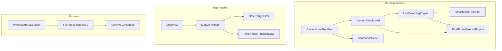
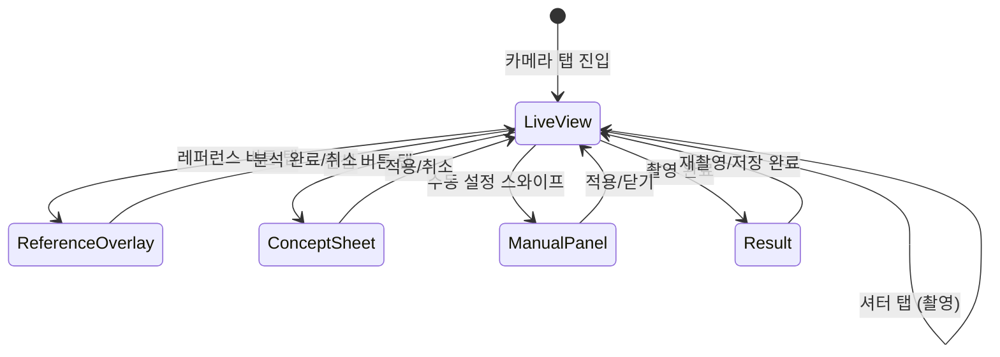

# Design Document: LensNote Evaluation Improvement

## Overview

이 설계 문서는 LensNote iOS 앱의 목표 기능 3가지(레퍼런스 기반 카메라 어시스턴트 / 실시간 구도 코칭 / 갤러리형 지도)의 달성도를 높이기 위한 기술적 설계를 정의한다.

핵심 변경 사항:
1. **라이브 코칭 델타 비교** — 레퍼런스 ShotRecipe와 라이브 프레임 ShotRecipe를 비교하여 실시간 코칭 메시지 생성
2. **카메라 진입 플로우 간소화** — 모드 선택 화면 제거, 즉시 라이브 뷰 진입, 인라인 모드 접근
3. **캡처 결과 피드백 강화** — 저장 완료 후 위치명/프리셋/스타일 정보를 포함한 결과 카드
4. **지도 기간/지역 필터** — DateRangeFilter 기반 핀 필터링
5. **기술적 안정성** — 영속성 스키마 버전, 자동화 테스트 기반, MapView 파일 분리

기존 MVVM + UseCase + Repository 아키텍처를 유지하면서, 새로운 기능을 기존 레이어에 자연스럽게 통합한다.

---

## Architecture

### 현재 아키텍처 (변경 없음)

```
┌─────────────────────────────────────────────────────┐
│  UI Layer (SwiftUI Views)                           │
│  CameraView / CameraLiveStepView / MapView / etc.  │
├─────────────────────────────────────────────────────┤
│  ViewModel Layer                                    │
│  CameraViewModel / MapViewModel / ProfileViewModel  │
├─────────────────────────────────────────────────────┤
│  Domain Layer                                       │
│  UseCase / Repository Protocol / Entities           │
├─────────────────────────────────────────────────────┤
│  Data Layer                                         │
│  FilePhotoRepository / Services                     │
├─────────────────────────────────────────────────────┤
│  Apple Frameworks                                   │
│  AVFoundation / CoreML / Vision / MapKit / Photos   │
└─────────────────────────────────────────────────────┘
```

### 신규 컴포넌트 배치



---

## Components and Interfaces

### 1. LiveCoachingEngine (신규)

레퍼런스 ShotRecipe와 라이브 프레임 ShotRecipe를 비교하여 코칭 메시지를 생성하는 순수 함수 모듈.

```swift
/// 라이브 코칭 델타 비교 결과
struct LiveCoachingDelta: Equatable {
    let coverageMessage: String?   // "더 멀리" / "더 가까이" / nil
    let angleMessage: String?      // "카메라를 올려주세요" 등 / nil
    
    var primaryMessage: String? {
        coverageMessage ?? angleMessage
    }
    
    var isEmpty: Bool {
        coverageMessage == nil && angleMessage == nil
    }
}

/// 순수 함수 — 상태 없음
enum LiveCoachingEngine {
    /// 레퍼런스와 라이브 프레임의 ShotRecipe를 비교하여 코칭 델타를 생성한다.
    /// - reference가 nil이면 nil 반환 (코칭 비활성)
    /// - 각 축(coverage, angle)이 nil이면 해당 축 메시지 생략
    static func compare(
        reference: ShotRecipe?,
        live: ShotRecipe
    ) -> LiveCoachingDelta?
    
    /// subjectCoverage 차이 임계값
    static let coverageThreshold: Double = 0.15
}
```

**위치**: `Features/Camera/LiveCoachingEngine.swift`

**설계 결정**: 상태 없는 `enum`으로 구현하여 테스트 용이성을 극대화한다. CameraViewModel이 소유하지 않고 호출만 한다.

### 2. CameraView 플로우 재설계 (Requirement 12)



**변경 사항**:
- `CameraInputMode` enum에서 `.select` 케이스 제거
- 초기 `step`을 `.camera`로 변경 (즉시 라이브 뷰)
- `CameraSelectionStepView` 제거
- 레퍼런스/컨셉/수동 설정을 라이브 뷰 내 오버레이/시트로 통합

```swift
/// 카메라 플로우 단계 (간소화)
private enum CameraInputMode: String {
    case camera    // 기본 진입점 — 라이브 뷰
    case result    // 촬영 결과
}

/// 라이브 뷰 내 인라인 모드 상태
enum InlineMode {
    case none
    case reference       // 레퍼런스 분석 오버레이
    case concept         // 컨셉 입력 바텀 시트
    case manual          // 수동 설정 접이식 패널
}
```

### 3. CameraLiveStepView 확장

기존 사이드 버튼에 액션을 연결하고, 인라인 모드 진입점을 추가한다.

```swift
// 신규 콜백/프로퍼티
struct CameraLiveStepView: View {
    // 기존 프로퍼티 유지...
    
    // 신규: 사이드 버튼 액션
    var onMapTap: (() -> Void)?
    var onGalleryTap: (() -> Void)?
    
    // 신규: 인라인 모드 진입점
    var onReferenceTap: (() -> Void)?
    var onConceptTap: (() -> Void)?
    var onManualTap: (() -> Void)?
    
    // 신규: 라이브 코칭 델타
    var liveCoachingMessage: String?
}
```

### 4. DateRangeFilter (신규)

```swift
/// 지도 기간 필터 열거형
enum DateRangeFilter: String, CaseIterable, Identifiable {
    case today = "오늘"
    case thisWeek = "이번 주"
    case thisMonth = "이번 달"
    case all = "전체"
    
    var id: String { rawValue }
    
    /// 주어진 날짜가 이 필터 범위에 포함되는지 판정한다.
    /// - Parameter date: 검사할 날짜
    /// - Parameter now: 현재 시각 (테스트 주입용, 기본값 Date())
    /// - Parameter calendar: 캘린더 (테스트 주입용, 기본값 .current)
    func includes(_ date: Date, now: Date = Date(), calendar: Calendar = .current) -> Bool
}
```

**위치**: `Features/Map/DateRangeFilter.swift`

**설계 결정**: `includes(_:now:calendar:)` 메서드에 `now`와 `calendar`를 주입 가능하게 하여 프로퍼티 기반 테스트에서 결정적 검증이 가능하도록 한다.

### 5. MapViewModel 필터 확장

```swift
extension MapViewModel {
    /// 현재 활성 기간 필터. 기본값 .all
    @Published var activeDateFilter: DateRangeFilter = .all
    
    /// 기간 필터가 적용된 핀 목록
    var filteredPins: [PhotoPin] {
        guard activeDateFilter != .all else { return pins }
        return pins.filter { activeDateFilter.includes($0.createdAt) }
    }
    
    /// 필터 변경 시 선택된 핀이 새 필터에 포함되지 않으면 선택 해제
    func applyDateFilter(_ filter: DateRangeFilter) {
        activeDateFilter = filter
        if let selected = selectedPin,
           !filter.includes(selected.createdAt) {
            closeCard()
        }
    }
}
```

### 6. FilePhotoRepository 스키마 버전 (Requirement 8)

```swift
/// 영속화 JSON 최상위 구조
struct PhotoStorageEnvelope: Codable {
    let schemaVersion: Int
    let items: [PhotoItem]
    
    static let currentVersion = 1
}
```

**마이그레이션 전략**:
- `schemaVersion < currentVersion`: 버전별 마이그레이션 함수 체인 실행
- `schemaVersion > currentVersion`: 빈 배열 반환 + 에러 로그
- 디코딩 실패: 빈 배열 반환 + 에러 로그

### 7. ProfileStatsCalculator (신규)

```swift
/// 촬영 통계 계산 결과
struct ProfileStats: Equatable {
    let totalPhotos: Int
    let topShotStyle: ShotStyle?      // 동률 시 최근 촬영 기준
    let topFilterPreset: String?      // 동률 시 최근 촬영 기준
}

/// 순수 함수 — PhotoItem 배열로부터 통계를 계산한다.
enum ProfileStatsCalculator {
    static func compute(from items: [PhotoItem]) -> ProfileStats
}
```

**위치**: `Features/Profile/ProfileStatsCalculator.swift`

**설계 결정**: 통계 계산을 순수 함수로 분리하여 ViewModel과 독립적으로 테스트 가능하게 한다. PhotoItem에 `shotStyle: ShotStyle?`과 `filterPresetName: String?` 필드를 추가해야 한다.

### 8. CameraCaptureResultStepView 강화 (Requirement 2)

```swift
/// 결과 카드에 표시할 정보
struct CaptureResultInfo {
    let thumbnail: UIImage
    let placeName: String?           // 역지오코딩 결과 (3초 타임아웃)
    let filterPresetName: String?
    let shotStyleLabel: String?      // 레퍼런스 설정 시에만
    let coordinate: GeoCoordinate?
    let canNavigateToMap: Bool       // coordinate != nil
}
```

### 9. MapView 파일 분리 (Requirement 7)

현재 `MapView.swift` (~250줄) 내 private struct들을 `Features/Map/Views/` 디렉토리로 분리:

| 현재 위치 | 분리 후 파일 |
|-----------|-------------|
| `PinAnnotationView` (MapView 내) | `Features/Map/Views/PinAnnotationView.swift` |
| `ClusterBadgeView` (MapView 내) | `Features/Map/Views/ClusterBadgeView.swift` |
| `SidePanelList` (MapView 내) | `Features/Map/Views/SidePanelList.swift` |
| `PinCardView` (MapView 내) | `Features/Map/Views/PinCardView.swift` |
| `PermissionOverlayView` (MapView 내) | `Features/Map/Views/PermissionOverlayView.swift` |
| `MapEmptyStateView` (MapView 내) | `Features/Map/Views/MapEmptyStateView.swift` |
| `LoadingBannerView` (MapView 내) | `Features/Map/Views/LoadingBannerView.swift` |
| `ClusterItem` (MapView 내) | `Features/Map/Models/ClusterItem.swift` |

접근 제어: `private` → `internal` (기본값)

---

## Data Models

### PhotoItem 확장

```swift
struct PhotoItem: Codable, Equatable, Identifiable {
    let id: UUID
    let createdAt: Date
    let imagePath: String
    let coordinate: GeoCoordinate?
    // 신규 필드
    let shotStyle: ShotStyle?
    let filterPresetName: String?
}
```

### PhotoStorageEnvelope (신규)

```swift
struct PhotoStorageEnvelope: Codable {
    let schemaVersion: Int
    let items: [PhotoItem]
}
```

### LiveCoachingDelta (신규)

```swift
struct LiveCoachingDelta: Equatable {
    let coverageMessage: String?
    let angleMessage: String?
    
    var primaryMessage: String? { coverageMessage ?? angleMessage }
    var isEmpty: Bool { coverageMessage == nil && angleMessage == nil }
}
```

### DateRangeFilter (신규)

```swift
enum DateRangeFilter: String, CaseIterable, Identifiable {
    case today, thisWeek, thisMonth, all
    var id: String { rawValue }
}
```

### ProfileStats (신규)

```swift
struct ProfileStats: Equatable {
    let totalPhotos: Int
    let topShotStyle: ShotStyle?
    let topFilterPreset: String?
}
```

### FilterPreset Codable 확장

```swift
extension FilterPreset: Codable {
    // JSON 직렬화/역직렬화 지원 추가
}
```

---

## Correctness Properties

*A property is a characteristic or behavior that should hold true across all valid executions of a system — essentially, a formal statement about what the system should do. Properties serve as the bridge between human-readable specifications and machine-verifiable correctness guarantees.*

### Property 1: Coverage delta coaching message correctness

*For any* reference ShotRecipe with non-nil subjectCoverage and *for any* live ShotRecipe with non-nil subjectCoverage, the LiveCoachingEngine SHALL produce "더 멀리" when (live - reference) >= 0.15, "더 가까이" when (live - reference) <= -0.15, and nil otherwise. When either coverage is nil, no coverage message SHALL be produced.

**Validates: Requirements 1.2, 1.8**

### Property 2: No coaching delta without reference

*For any* live ShotRecipe, when the reference ShotRecipe is nil, the LiveCoachingEngine SHALL return nil (no coaching delta generated).

**Validates: Requirements 1.5**

### Property 3: DateRangeFilter date inclusion correctness

*For any* Date value and *for any* DateRangeFilter value, the `includes(_:now:calendar:)` method SHALL return true if and only if the date falls within the defined range (today: same calendar day, thisWeek: since last Monday 00:00, thisMonth: since 1st of month 00:00, all: always true).

**Validates: Requirements 6.1, 6.2**

### Property 4: Filter change clears invalid selection

*For any* MapViewModel state with a selectedPin, and *for any* DateRangeFilter transition where the selectedPin's createdAt is NOT included in the new filter range, applying the filter SHALL result in selectedPin becoming nil.

**Validates: Requirements 6.6**

### Property 5: Spatial region filtering

*For any* set of PhotoPins and *for any* MKCoordinateRegion, the visible pins list SHALL contain only pins whose coordinates fall within the region's latitude and longitude bounds.

**Validates: Requirements 6.7**

### Property 6: PhotoItem persistence round-trip

*For any* valid PhotoItem (with valid id, createdAt, imagePath, and optional coordinate/shotStyle/filterPresetName), saving to FilePhotoRepository and then calling fetchAll SHALL return a list containing a PhotoItem with identical property values.

**Validates: Requirements 8.1, 8.2, 9.5**

### Property 7: FilterPreset serialization round-trip

*For any* valid FilterPreset object (with name, exposure, contrast, saturation, temperature, vignette values), JSON encoding followed by JSON decoding SHALL produce an object with identical property values.

**Validates: Requirements 9.6**

### Property 8: Profile statistics computation

*For any* non-empty list of PhotoItems with associated shotStyle and filterPresetName values, the ProfileStatsCalculator SHALL return totalPhotos equal to the list count, topShotStyle equal to the most frequent style (tie-broken by most recent createdAt), and topFilterPreset equal to the most frequent preset name (tie-broken by most recent createdAt).

**Validates: Requirements 5.1**

---

## Error Handling

### Camera Pipeline

| 에러 상황 | 처리 방식 |
|-----------|-----------|
| CoreML 모델 로드 실패 | nil 반환, Vision fallback 유지 |
| DeepLabV3 shape 불일치 | 에러 로그 + nil 반환, 다음 프레임 계속 |
| 두 모델 모두 실패 | nil 반환, 크래시 없이 동작 지속 |
| thermalState critical | 추론 건너뜀, nil 반환 |
| ShotRecipeAnalyzer Task 취소 | referenceAnalysisStage → .idle, 상태 초기화 |
| 라이브 프레임 ShotRecipe 추출 실패 | 해당 프레임 코칭 스킵, 다음 프레임 재시도 |

### Persistence

| 에러 상황 | 처리 방식 |
|-----------|-----------|
| JSON 디코딩 실패 | 빈 배열 반환 + os_log 에러 기록 |
| schemaVersion > current | 빈 배열 반환 + 에러 로그 |
| schemaVersion < current | 마이그레이션 시도, 실패 시 빈 배열 |
| 파일 쓰기 실패 | NSError throw → ViewModel에서 errorMessage 표시 |
| 이미지 파일 누락 | PhotoItem은 유지, 썸네일 placeholder 표시 |

### Map / Geocoding

| 에러 상황 | 처리 방식 |
|-----------|-----------|
| 역지오코딩 3초 타임아웃 | "위치명을 불러올 수 없음" 표시 |
| 사진 라이브러리 권한 거부 | PermissionOverlayView 표시 + 설정 이동 동선 |
| 필터 결과 0건 | 빈 상태 메시지 표시 |

### Capture Result

| 에러 상황 | 처리 방식 |
|-----------|-----------|
| 사진 저장 실패 | 에러 메시지 + 재시도 버튼, 이미지 데이터 메모리 유지 |
| 위치 좌표 nil | "위치 정보 없음" 표시, 지도 버튼 비활성 |

---

## Testing Strategy

### 프로퍼티 기반 테스트 (Property-Based Testing)

**라이브러리**: [swift-testing](https://github.com/apple/swift-testing) + 커스텀 랜덤 생성기

각 Correctness Property에 대해 최소 100회 반복 실행하는 프로퍼티 기반 테스트를 작성한다.

| Property | 테스트 대상 | 생성기 |
|----------|------------|--------|
| Property 1 | `LiveCoachingEngine.compare` | 랜덤 Double(0...1) coverage 쌍 |
| Property 2 | `LiveCoachingEngine.compare` | 랜덤 ShotRecipe + nil reference |
| Property 3 | `DateRangeFilter.includes` | 랜덤 Date + 랜덤 filter + 고정 now |
| Property 4 | `MapViewModel.applyDateFilter` | 랜덤 pin + 랜덤 filter 전환 |
| Property 5 | `visiblePins` 계산 | 랜덤 좌표 핀 + 랜덤 region |
| Property 6 | `FilePhotoRepository` save/fetch | 랜덤 PhotoItem |
| Property 7 | `FilterPreset` encode/decode | 랜덤 FilterPreset |
| Property 8 | `ProfileStatsCalculator.compute` | 랜덤 PhotoItem 배열 |

**태그 형식**: `Feature: lensnote-evaluation-improvement, Property {N}: {title}`

### 단위 테스트 (Example-Based)

| 모듈 | 테스트 케이스 |
|------|-------------|
| `AIInferenceAggregator` | (a) 0/0 → 0.0, (b) 1.0/1.0 → 1.0, (c) nil/nil → 기본값 |
| `ShotRecipeAnalyzer` | aerialSelfie/mirrorSelfie/landscape/unknown 각 조건 |
| `FilterPreset.forConcept` | (a) 매핑 키워드, (b) 빈 문자열, (c) 미매핑 키워드 |
| `FilePhotoRepository` | (a) save→fetchAll 라운드트립, (b) 빈 초기 상태 |
| `CameraAngle` 매핑 | 6개 non-equal (ref, live) 쌍 → 올바른 메시지 |
| 디바운스 로직 | 0.9s 미만 미승격, 1.6s 미만 미제거 |

### 통합 테스트

| 시나리오 | 검증 항목 |
|---------|-----------|
| 실기기 CoreML 추론 | 모델 로드 5초 이내, 첫 추론 결과 반환 |
| 영속성 라운드트립 | 촬영 → 저장 → 앱 종료 → 재시작 → 지도 핀 표시 |
| 역지오코딩 타임아웃 | 3초 초과 시 fallback 텍스트 |

### 접근성 테스트

모든 AccessibilityIdentifier가 뷰 상태 변경과 무관하게 유지되는지 XCUITest로 검증:
- `camera.shutter`, `camera.ai_magic`, `camera.guidance_banner`
- `camera.side_map`, `camera.side_gallery`
- `camera.select_reference`, `camera.select_concept`
- `map.pin.{id}`, `dock.tab.{name}`

### 수동 QA 체크리스트

목표 기능 달성도 평가 (Requirement 11):
- 기능 1 (레퍼런스 카메라): 4개 항목
- 기능 2 (실시간 코칭): 4개 항목
- 기능 3 (갤러리형 지도): 5개 항목
