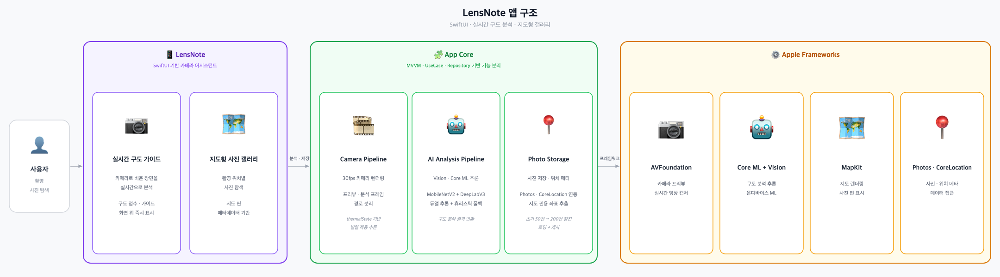

# LensNote

**카메라가 구도를 봐주고, 지도가 기억을 정리해주는 SwiftUI 사진 앱**

LensNote는 단순한 사진 유틸리티가 아니라 *카메라 어시스턴트* + *장소 기반 메모리 브라우저* 컨셉으로 만든 iOS 포트폴리오 프로젝트입니다.
실시간으로 장면을 분석해 구도 가이드를 띄우고, 촬영된 사진은 그리드가 아닌 **지도 핀**으로 다시 만나도록 설계했습니다.

- **SwiftUI** 기반의 카메라/지도/홈 화면
- **MVVM + UseCase + Repository** 레이어 분리
- **Core ML 듀얼 추론**(MobileNetV2 + DeepLabV3) + Vision 휴리스틱 폴백
- 촬영 좌표 자동 결합 → 지도 핀으로 즉시 가시화
- LensNote 자체 저장본과 시스템 사진 라이브러리를 **머지**해서 표시

---

## 앱 구조



세 개의 큰 레이어로 분리되어 있습니다.

| 레이어 | 책임 | 대표 파일 |
| --- | --- | --- |
| **LensNote (UI)** | SwiftUI View, 사용자 인터랙션, 디자인 시스템 | `Features/Camera/CameraView.swift`, `Features/Map/MapView.swift` |
| **App Core** | MVVM 뷰모델 · UseCase · Repository · 카메라 / AI / 저장 파이프라인 | `Features/Camera/CameraViewModel.swift`, `Domain/UseCase/*`, `Features/Camera/RealTimeInferenceEngine.swift` |
| **Apple Frameworks** | AVFoundation · Core ML + Vision · MapKit · Photos / CoreLocation | (시스템 SDK) |

---

## 핵심 기능

### 1. 실시간 구도 가이드 (Camera + AI Pipeline)

카메라 프리뷰에서 분석용 프레임을 분리해 30fps 렌더링은 유지하면서, 별도 큐에서 Core ML 추론을 돌립니다.

- **MobileNetV2** — ImageNet 라벨을 LensNote의 `SceneType`(portrait / landscape / cityStreet / food / pet / night ...)으로 매핑
- **DeepLabV3** — semantic segmentation으로 사람 픽셀 비율을 계산해 portrait 보정
- **Aggregator** — 두 결과를 합산해 `inferenceScore = confidence * 0.6 + 구도점수 * 0.4`로 환산
- **삼등분선 편차**가 0.12를 넘으면 "왼쪽으로 살짝", "위쪽으로" 같은 방향 힌트 문구를 생성
- **힌트 디바운스** — 동일 힌트가 0.9s 이상 지속되어야 노출, 노출되면 최소 1.6s 유지(깜빡임 방지)
- **그레이스풀 폴백** — 모델 로드/추론이 실패하면 Vision 기반 휴리스틱이 자동으로 떠받침

### 2. 컨셉 → 프리셋 실시간 미리보기

사용자가 입력한 컨셉(야경 / 인물 / 풍경 / 무드 / 빈티지 등)을 키워드 매칭해 `FilterPreset.forConcept(_:)` 한 곳에서 룰을 결정합니다.
입력 즉시 추천 프리셋 카드(`PresetSummaryView`)가 떠서, 노출/대비/채도/온도/비네트가 어떻게 바뀌는지 슬라이더 시각화로 확인할 수 있습니다.

### 3. 레퍼런스 사진 온보딩

레퍼런스 사진을 한 장 고르면 3단계 분석 애니메이션(톤 → 컬러 → 프리셋, 약 1.8s)으로 시각화한 뒤, 생성된 프리셋 요약 카드와 **"이 톤으로 촬영 시작"** CTA를 노출합니다. 라이브 뷰 좌측 하단 REF 썸네일에 그대로 반영됩니다.

### 4. 지도형 사진 갤러리 (Photo Storage Pipeline)

- 촬영 시점에 `LocationProvider`가 좌표를 결합 → `SavePhotoUseCase`가 `FilePhotoRepository`(JSON on disk)로 영속화
- `FetchPhotoPinsUseCase`가 LensNote 자체 핀 + `PHPhotoLibrary` 핀을 머지해서 반환
- **점진 로딩**: 초기 50건(`initialBatchSize`) → 200건(`batchSize`) 단위 페이징
- 클러스터링 / 사이드 패널 / 핀 카드(원본 source 뱃지) UI 모두 자체 구현
- 권한 미허용 / 빈 상태 / 에러 상태 각각의 화면 분기 보유

---

## 어필 포인트 (포트폴리오 관점)

| 포인트 | 구현 위치 |
| --- | --- |
| **MVVM + UseCase + Repository** 레이어 분리 | `Domain/{Entities,UseCase,Repositories,Services}` |
| **온디바이스 듀얼 ML 추론** + 휴리스틱 폴백 | `Features/Camera/{MobileNetV2Service,DeepLabV3Service,AIInferenceAggregator,RealTimeInferenceEngine}.swift` |
| **AVFoundation 세션 큐 분리**로 30fps 유지 | `CameraViewModel.swift` |
| **자체 저장소(JSON) + PHPhotoLibrary 머지** | `Domain/Repositories/FilePhotoRepository.swift`, `Features/Map/Services/PhotoLibraryService.swift` |
| **디자인 시스템 토큰화** (색/타이포/스페이싱) | `DesignSystem/LensNoteTheme.swift` |
| **PBXFileSystemSynchronizedRootGroup** 사용한 자동 Xcode 동기화 워크플로우 | `LensNote.xcodeproj` |

---

## 프로젝트 구조

```
LensNote/
├── Application/                  # 앱 엔트리, DI 컨테이너, 루트 탭
│   ├── LensNoteApp.swift
│   ├── DIContainer.swift
│   └── RootView.swift
├── Features/
│   ├── Home/                     # 홈 (Quick Shot, Map Gallery preview, Recent Sessions)
│   ├── Camera/                   # 카메라 + AI 파이프라인
│   │   ├── CameraViewModel.swift
│   │   ├── RealTimeInferenceEngine.swift
│   │   ├── MobileNetV2Service.swift
│   │   ├── DeepLabV3Service.swift
│   │   ├── AIInferenceAggregator.swift
│   │   ├── CompositionGuidanceEngine.swift
│   │   ├── LocationProvider.swift
│   │   └── Views/                # 단계별 SwiftUI 뷰
│   ├── Map/                      # 지도 갤러리
│   │   ├── MapView.swift
│   │   ├── MapViewModel.swift
│   │   ├── Services/             # GeocodingService, PhotoLibraryService
│   │   └── Views/                # PinAnnotation, ClusterBadge, PinCard ...
│   └── Profile/
├── Domain/
│   ├── Entities/                 # PhotoItem, PhotoPin, FilterStyle, SceneType ...
│   ├── UseCase/                  # SavePhotoUseCase, FetchPhotoPinsUseCase
│   ├── Repositories/             # FilePhotoRepository, LocalPhotoRepository
│   └── Services/
├── Data/
├── Core/
├── DesignSystem/
│   ├── LensNoteTheme.swift
│   └── Components/
├── Resources/                    # 모델 스키마, 카메라/데이터 문서
└── Assets.xcassets/
```

---

## 기술 스택

- **UI** — SwiftUI, MapKit
- **Camera** — AVFoundation (세션 큐 분리, 프리뷰/분석 프레임 분리)
- **AI** — Core ML, Vision (`MobileNetV2.mlmodel`, `DeepLabV3.mlmodel`)
- **Persistence** — JSON 파일 영속화 (`FilePhotoRepository`) + `PHPhotoLibrary` 머지
- **Location** — CoreLocation (`LocationProvider`로 추상화, 권한 미허용 시 toast)
- **빌드** — Xcode 16+, iOS 26 시뮬레이터 검증

---

## 빌드 / 실행

```bash
open LensNote.xcodeproj
```

1. iPhone 17 Pro Simulator(iOS 26.4)에서 빌드 검증되어 있습니다.
2. 카메라/위치 권한이 필요합니다(`NSCameraUsageDescription`, `NSLocationWhenInUseUsageDescription`, `NSPhotoLibraryUsageDescription`).
3. `MobileNetV2.mlmodel`, `DeepLabV3.mlmodel`은 저장소 루트에 포함되어 있고 Xcode 타겟에 멤버로 포함되어 있어야 합니다.
4. 시뮬레이터 자동화는 XcodeBuildMCP 기반으로 `.xcodebuildmcp/config.yaml`에 디폴트가 정의되어 있습니다.

---

## 문서

- [`docs/LENSNOTE_PRODUCT_GOAL.md`](docs/LENSNOTE_PRODUCT_GOAL.md) — 최종 제품 목표
- [`docs/LENSNOTE_BACKLOG.md`](docs/LENSNOTE_BACKLOG.md) — 우선순위 백로그
- [`docs/ACTIVE_CONTEXT.md`](docs/ACTIVE_CONTEXT.md) — 현재 핸드오프 상태와 다음 작업
- [`CLAUDE.md`](CLAUDE.md) — Claude Code 협업 가이드 (MVVM 규칙, 위임 정책)
